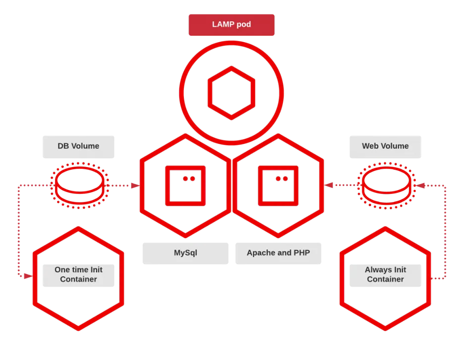

# 5 underused Podman features to try now

1. Utilize pods

Example: The first container in the pod will run MySQL:

```sh
$ podman run -dt --pod new:example docker.io/library/mysql:latest
7edd8961a0ca11932491899afa29c7a36adb17421345007de66a69247164daa9
```

And now I can add another container to the pod with the podman run command:

```sh
$ podman run -dt --pod example quay.io/libpod/alpine_nginx
0f7ecf9bec272420e649bf4fc59bce3c6f3acfd76ebd87dda2ec84e69f33fd2d
```

A pod that contains a database and a web server within a pod looks like this:

```sh
$ podman pod ls
POD ID NAME STATUS CREATED INFRA ID # OF CONTAINERS
5e157786e495 example Running 4 minutes ago 918771c42cc1 3
```

I can further inspect the pod's contents by adding the --pod option to podman ps.

```sh
$ podman ps --pod
CONTAINER ID IMAGE COMMAND CREATED STATUS PORTS NAMES POD ID PODNAME
918771c42cc1 localhost/podman-pause:4.0.0-dev-1645134365 4 minutes ago Up 4 minutes ago 5e157786e495-infra 5e157786e495 example
0f7ecf9bec27 quay.io/libpod/alpine_nginx:latest nginx -g daemon o... 4 minutes ago Up 4 minutes ago nginx 5e157786e495 example
7edd8961a0ca docker.io/library/mysql:latest mysqld About a minute ago Up About a minute ago db 5e157786e495 example
```

2. Understand init containers
   LAMP pod
   

3. Create additional image stores

Here is what the default image store looks like:

```sh
$ podman images
REPOSITORY TAG IMAGE ID CREATED SIZE
docker.io/library/rust 1-slim-buster 3ca1d8ed11bf 7 days ago 653 MB
docker.io/library/debian buster 739ca6e61c27 8 days ago 119 MB
docker.io/library/alpine latest c059bfaa849c 3 months ago 5.87 MB
quay.io/libpod/helloworld latest d7b9a2cfb457 4 months ago 5.87 MB
```

Then I will set the permissions so the wheel group can read and write to it:

```sh
$ sudo mkdir --mode=u+rwx,g+rws /var/sharedstore
$ sudo chgrp -R wheel /var/sharedstore
```

Now I'll create the store. The easiest way is to populate the store with an image. Because the additional store is read-only, use the --root parameter to point to only the extra share, which will allow users to write to it:

```sh
$ podman --root /var/sharedstore/ pull fedora
Resolved "fedora" as an alias (/etc/containers/registries.conf.d/000-shortnames.conf)
Trying to pull registry.fedoraproject.org/fedora:latest...
Getting image source signatures
Copying blob 9c6cc3463716 done
Copying config 750037c05c done
Writing manifest to image destination
Storing signatures
750037c05cfe1857e16500167c7c217658e15eb9bc6283020cfb3524c93d1240
```

I'm using Fedora 35, and as such, I need to set SELinux permissions for the new store:

```sh
$ sudo semanage fcontext -a -e /var/lib/containers/storage /var/sharedstore
$ sudo restorecon -r /var/sharedstore/
```

The next step is to teach Podman about the additional store. Do this by editing the respective storage.conf files. For unprivileged users, that is usually $HOME/.config/containers/storage.conf; and for rootfull users it is /etc/containers/storage.conf. Those files are not likely to already exist, so just add the following to enable the share:

```sh
[storage]
driver = "overlay"
[storage.options]
additionalimagestores = [ "/var/sharedstore"
]
```

With that, the additional store should be enabled. The real test will be if the Fedora image is now seen as an available image.

```sh
$ podman images
REPOSITORY TAG IMAGE ID CREATED SIZE R/O
docker.io/library/rust 1-slim-buster 3ca1d8ed11bf 7 days ago 653 MB false
docker.io/library/debian buster 739ca6e61c27 8 days ago 119 MB false
localhost/foobar latest 750037c05cfe 2 weeks ago 159 MB false
registry.fedoraproject.org/fedora latest 750037c05cfe 2 weeks ago 159 MB true
docker.io/library/alpine latest c059bfaa849c 3 months ago 5.87 MB false
quay.io/libpod/helloworld latest d7b9a2cfb457 4 months ago 5.87 MB false
```

You can basically use images in additional stores as you would regular images. Just remember that the store itself is read-only.

```sh
$ podman run -it --rm fedora cat /etc/redhat-release
Fedora release 35 (Thirty Five)
```

[ Want to test your sysadmin skills? Take a skills assessment today. ]

Earlier, I mentioned that the root user could share the additional image store. To do so, root must edit /etc/containers/storage.conf and add the additional store. As was mentioned above, the store can be made accessible for rootfull and rootless users if given the correct permissions. After the root user edits storage.conf, a rootfull user can see the secondary store:

```sh
$ sudo podman images
REPOSITORY TAG IMAGE ID CREATED SIZE R/O
docker.io/nicolaka/netshoot latest f56a7d7fefd7 33 hours ago 452 MB false
registry.fedoraproject.org/fedora latest 750037c05cfe 2 weeks ago 159 MB true
```

4. Use the system reset command

One command I didn't use until recently is Podman's system reset. As a Podman developer, I have to do quite a bit of container and image teardown after developing some feature or debugging a very specific problem. While I use Podman's -a switch to remove images, I still have to issue one command for containers and a different one for images, unless I remember podman rmi -fa deletes all containers and images.

Even so, this can leave artifacts in the stores. Using podman system reset –force deletes the stores, resulting in a more thorough removal of everything. Any network configurations you created will also be deleted. This is like hitting the reset button on your phone. When the process completes, it is like you never ran Podman.

Here is an example of a container image store:

```sh
$ podman images
REPOSITORY TAG IMAGE ID CREATED SIZE
localhost/sillyboy latest a1e9cccd2fab 2 days ago 5.62 GB
docker.io/library/postgres latest 6a3c44872108 4 days ago 382 MB
quay.io/libpod/alpine_nginx latest 036646f5d23c 4 days ago 23.2 MB
localhost/net latest 036646f5d23c 4 days ago 23.2 MB
<none> <none> 14b53822edb2 4 days ago 21.8 MB
quay.io/libpod/alpine_labels latest 5e9e9275e4d6 4 days ago 5.87 MB
localhost/foo latest 5b910e0d7ae8 4 days ago 5.87 MB
docker.io/library/golang 1.16 221c5472423f 8 days ago 941 MB
quay.io/coreos-assembler/coreos-assembler latest f6bcef5d1fe4 8 days ago 6.23 GB
registry.fedoraproject.org/fedora 35 cb29aee23f9f 10 days ago 174 MB
quay.io/baude/buildnetworkstuff latest c9c5fe8be389 2 weeks ago 2.12 GB
quay.io/libpod/get_ci_vm latest 6059469ab445 3 weeks ago 646 MB
docker.io/library/ubuntu latest d13c942271d6 6 weeks ago 75.2 MB
registry.fedoraproject.org/fedora latest 3059bef432eb 2 months ago 159 MB
docker.io/library/alpine latest c059bfaa849c 2 months ago 5.87 MB
quay.io/libpod/fedora-minimal latest 7b0f8c69a29c 3 months ago 119 MB
quay.io/libpod/banner latest 4d50a7b41aa3 3 months ago 11.9 MB
quay.io/centos/centos latest 300e315adb2f 14 months ago 217 MB
quay.io/libpod/alpine latest 961769676411 2 years ago 5.85 MB
<none>
```

And networks:

```sh
$ podman network ls
NETWORK ID NAME DRIVER
2f259bab93aa podman bridge
7dfd63bf6076 podman1 bridge
c2a0a3d33c54 podman3 bridge
1b4cc8285951 podman4 bridge
6d87c5bfefa8 podman7 bridge
37f3e42c28fe testing bridge
```

After executing podman system reset –force, check the store again:

```sh
$ podman images
REPOSITORY TAG IMAGE ID CREATED SIZE
```

As you can see, the image store is gone. Below, you can see just the default network remains.

```sh
$ podman network ls
NETWORK ID NAME DRIVER
2f259bab93aa podman bridge
```

5. Use the play kube command
   Here is a snippet of the full YAML file:

```sh
# Save the output of this file and use kubectl create -f to import

# it into Kubernetes.

#

# Created with podman-4.0.0-dev

apiVersion: v1
kind: Pod
metadata:
annotations:
bind-mount-options:/home/baude/my-lamp-project/mydbstuff: Z
bind-mount-options:/home/baude/my-lamp-project/mywebstuff: Z
creationTimestamp: "2021-10-01T13:53:45Z"
labels:
app: lamp
name: lamp
spec:
containers:

- args:
  - mysqld
    command:
    ….
    clipped for brevity
```

To play this file with Podman

```sh
$ sudo podman play kube lamp.yaml
STEP 1/2: FROM docker.io/library/mariadb
STEP 2/2: COPY my.cnf /etc/mysql/my.cnf
COMMIT localhost/mariadb-conf:latest
--> d2ed21332b9
Successfully tagged localhost/mariadb-conf:latest
d2ed21332b9f4c54bb5d2f9760c1d0a5756f9cd2bdef59ad59b7de9307c3fb0b
…
cut for brevity
…
debconf: unable to initialize frontend: Dialog
debconf: (TERM is not set, so the dialog frontend is not usable.)
debconf: falling back to frontend: Readline
Setting up libcurl3-gnutls:amd64 (7.64.0-4+deb10u2) ...
Setting up liberror-perl (0.17027-2) ...
Setting up libx11-data (2:1.6.7-1+deb10u2) ...
Setting up libpcre2-8-0:amd64 (10.32-5) ...
Setting up git-man (1:2.20.1-2+deb10u3) ...
Setting up libx11-6:amd64 (2:1.6.7-1+deb10u2) ...
Setting up libxmuu1:amd64 (2:1.1.2-2+b3) ...
Setting up libxext6:amd64 (2:1.3.3-1+b2) ...
Setting up git (1:2.20.1-2+deb10u3) ...
Setting up xauth (1:1.0.10-1) ...
Processing triggers for libc-bin (2.28-10) ...
Processing triggers for mime-support (3.62) ...
COMMIT localhost/php-7.2-apache-mysqli:latest
--> 663f4f7b71e
Successfully tagged localhost/php-7.2-apache-mysqli:latest
663f4f7b71e94ca43282a6287570b6c2b069239fde709b31ae5c55eab965e992
Pod:
51ce1f660d397e415bc3414b6714cceb383c1c0f01bc714aef84399c0e5e7a0e
Containers:
0113426a064689956f5ce0e583f25eaef1f947dabf9fdedb0af60040ed52963d
8024181e824a057bf48119e73e994ede5778670b893dc51d554cab1ff196d158
```

Podman can see the newly built images:

```sh
$ sudo podman images
REPOSITORY TAG IMAGE ID CREATED SIZE R/O
localhost/php-7.2-apache-mysqli latest 663f4f7b71e9 40 seconds ago 474 MB false
localhost/mariadb-conf latest d2ed21332b9f About a minute ago 421 MB false
localhost/podman-pause 4.0.0-dev-1646776032 5554f9095246 About a minute ago 812 kB false
docker.io/library/mariadb latest f5dd1ac0b00e 14 hours ago 421 MB false
registry.fedoraproject.org/fedora latest 750037c05cfe 2 weeks ago 159 MB true
docker.io/library/php 7.2-apache c61d277263e1 15 months ago 419 MB false
```

Observe the running pod using podman pod ps:

```sh
$ sudo podman pod ps
POD ID NAME STATUS CREATED INFRA ID # OF CONTAINERS
51ce1f660d39 lamp Running About a minute ago 25008abcc0be 5
```

For more detail on the running containers inside the pod, podman ps displays the database and Apache containers that are running:

```sh
$ sudo podman ps
CONTAINER ID IMAGE COMMAND CREATED STATUS PORTS NAMES
25008abcc0be localhost/podman-pause:4.0.0-dev-1646776032 About a minute ago Up About a minute ago 0.0.0.0:8080->80/tcp 51ce1f660d39-infra
0113426a0646 localhost/mariadb-conf:latest mysqld About a minute ago Up About a minute ago 0.0.0.0:8080->80/tcp lamp-bravegauss
8024181e824a localhost/php-7.2-apache-mysqli:latest apache2-foregroun... About a minute ago Up About a minute ago 0.0.0.0:8080->80/tcp lamp-dazzlingelgamal
```

Wrap up

These are my top five Podman features that many container users underutilize. There is a common theme among several of them: simplification.

Pods, init containers, additional stores, and system reset all have great potential for simplifying containers and how you interact with them. In the case of pods and init containers, they make it simpler to deploy. Additional stores make more efficient use of your disk space and allow you to share images between users. And finally, system reset enables you to completely reset your container environment with one simple command.

And my personal favorites, podman generate and play kube, allow you to document your pods and containers in Kubernetes YAML files. These files enable you to easily recreate those pods and containers on any Kubernetes cluster.
