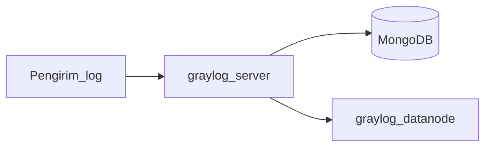

# Graylog di Debian 12 (Bookworm)

Panduan ini merangkum pemasangan **Graylog** pada **Debian 12** mengikuti dokumentasi resmi untuk arsitektur **Graylog Core** (satu node **Graylog + MongoDB**, satu node **Data Node**). Gunakan bersama cuplikan di folder [examples/](examples/).

**Dokumentasi resmi (sumber kebenaran):** [Debian Installation: Single Graylog Node](https://go2docs.graylog.org/current/downloading_and_installing_graylog/debian_installation.htm)

**Perbandingan di repo ini:** untuk log server berbasis **syslog klasik ke file** (tanpa stack Graylog), lihat [syslog-ng](../syslog-ng/README.md).

---

## Isi dokumen

1. [Pengantar](#pengantar)
2. [Arsitektur minimal (resmi)](#arsitektur-minimal-resmi)
3. [Prasyarat](#prasyarat)
4. [Zona waktu](#zona-waktu)
5. [MongoDB 8.0](#mongodb-80)
6. [Data Node](#data-node)
7. [Graylog Server](#graylog-server)
8. [Preflight dan UI pertama](#preflight-dan-ui-pertama)
9. [Firewall dan verifikasi](#firewall-dan-verifikasi)
10. [Keamanan dan produksi](#keamanan-dan-produksi)
11. [Laboratorium satu VM (opsional)](#laboratorium-satu-vm-opsional)
12. [Referensi](#referensi)

---

## Pengantar

**Graylog** adalah platform manajemen log terpusat: menerima log dari berbagai sumber, memproses, mengindeks, dan menyediakan pencarian serta dashboard. Stack resmi untuk Graylog 7 memakai **MongoDB** (metadata), **Graylog Server** (API dan antarmuka web), dan **Graylog Data Node** (ingesti dan indeks pencarian; **jangan** memasang OpenSearch secara terpisah jika Anda mengikuti jalur Data Node — lihat dokumentasi “Installing Graylog” untuk skenario self-managed OpenSearch).

---

## Arsitektur minimal (resmi)

Panduan Debian tunggal untuk Graylog Core mengasumsikan **dua peran host**: satu untuk **Graylog + MongoDB**, satu untuk **Data Node**. Hubungan jaringan antar komponen harus dapat mencapai port yang dibutuhkan; daftar lengkap ada di dokumentasi Graylog ([Network Connectivity and Firewall Requirements](https://go2docs.graylog.org/current/setting_up_graylog/network_connectivity.htm)).



Untuk klaster beberapa node Graylog, ikuti panduan terpisah: [Debian Installation: Multiple Graylog Nodes](https://go2docs.graylog.org/current/downloading_and_installing_graylog/debian_installation_multiple_nodes.htm).

---

## Prasyarat

- Debian 12 (Bookworm) terpasang, akses **root** atau **sudo** (contoh di bawah memakai `sudo`; sesuaikan jika Anda login sebagai root).
- Pastikan **port** yang diperlukan terbuka antar node sesuai [persyaratan jaringan Graylog](https://go2docs.graylog.org/current/setting_up_graylog/network_connectivity.htm); panduan instalasi umum mengasumsikan firewall tidak memblokir lalu lintas yang diperlukan untuk langkah awal.
- Dokumentasi Graylog **menganjurkan filesystem XFS** untuk penyimpanan dan meninjau [rekomendasi sumber daya](https://go2docs.graylog.org/current/setting_up_graylog/core_architecture.htm) sebelum produksi.
- Cek **matriks kompatibilitas** MongoDB, OS, dan Graylog di dokumentasi Graylog untuk versi yang Anda pilih.

---

## Zona waktu

Menyetel zona waktu server (contoh **UTC**, sama seperti panduan resmi):

```sh
sudo timedatectl set-timezone UTC
```

---

## MongoDB 8.0

Ikuti tutorial MongoDB untuk Debian atau ringkasan berikut; panduan Graylog mengasumsikan **MongoDB 8.0** untuk kombinasi Graylog 7 dan Debian 12 — verifikasi di [compatibility matrix](https://go2docs.graylog.org/current/setting_up_graylog/compatibility_matrix.htm).

1. Pasang alat kunci dan unduhan:

```sh
sudo apt-get update
sudo apt-get install -y gnupg curl
```

2. Impor kunci publik MongoDB dan buat berkas sumber `bookworm` / `8.0`:

```sh
curl -fsSL https://www.mongodb.org/static/pgp/server-8.0.asc | \
  sudo gpg -o /usr/share/keyrings/mongodb-server-8.0.gpg \
  --dearmor
```

```sh
echo "deb [ signed-by=/usr/share/keyrings/mongodb-server-8.0.gpg ] http://repo.mongodb.org/apt/debian bookworm/mongodb-org/8.0 main" | sudo tee /etc/apt/sources.list.d/mongodb-org-8.0.list
```

3. Pasang MongoDB, tahan versi agar tidak naik otomatis saat `upgrade` besar:

```sh
sudo apt-get update
sudo apt-get install -y mongodb-org
sudo apt-mark hold mongodb-org
```

4. Edit **`/etc/mongod.conf`**: secara bawaan MongoDB hanya mendengarkan lokal. Agar node lain (misalnya Data Node) dapat terhubung, atur **`bindIpAll: true`** atau **`bindIp`** ke alamat atau nama host tertentu (lihat [dokumentasi instalasi Graylog](https://go2docs.graylog.org/current/downloading_and_installing_graylog/debian_installation.htm)).

Contoh mendengarkan di semua antarmuka:

```yaml
net:
  port: 27017
  bindIpAll: true
```

5. Aktifkan dan jalankan layanan:

```sh
sudo systemctl daemon-reload
sudo systemctl enable mongod.service
sudo systemctl start mongod.service
```

---

## Data Node

Pasang pada **host Data Node** (terpisah dari Graylog+MongoDB sesuai arsitektur resmi).

1. Tambahkan repositori Graylog dan pasang paket Data Node (sesuaikan URL `.deb` dengan versi Graylog yang Anda targetkan; contoh berikut mengikuti dokumentasi 7.0):

```sh
wget https://packages.graylog2.org/repo/packages/graylog-7.0-repository_latest.deb
sudo dpkg -i graylog-7.0-repository_latest.deb
sudo apt-get update
sudo apt-get install -y graylog-datanode
```

2. Pastikan **`vm.max_map_count`** minimal **262144**:

```sh
cat /proc/sys/vm/max_map_count
```

Jika perlu menaikkan (persisten):

```sh
echo 'vm.max_map_count=262144' | sudo tee /etc/sysctl.d/99-graylog-datanode.conf
sudo sysctl --system
cat /proc/sys/vm/max_map_count
```

Cuplikan berkas sysctl ada di [examples/sysctl-graylog-datanode.conf.example](examples/sysctl-graylog-datanode.conf.example).

3. Buat **`password_secret`** (string acak; **harus sama** nanti di Graylog Server):

```sh
openssl rand -hex 32
```

4. Edit **`/etc/graylog/datanode/datanode.conf`**:

   - Set **`password_secret`** ke nilai dari langkah di atas.
   - Tambahkan **`opensearch_heap`** (properti ini **tidak** ada di berkas bawaan): setengah RAM sistem, maksimum sesuai panduan Graylog (misalnya **31g** untuk Data Node — lihat dokumentasi).
   - Set **`mongodb_uri`** mengarah ke host MongoDB Anda, misalnya:

```ini
mongodb_uri = mongodb://nama-host-mongodb:27017/graylog
```

5. Aktifkan dan jalankan:

```sh
sudo systemctl daemon-reload
sudo systemctl enable graylog-datanode.service
sudo systemctl start graylog-datanode
```

---

## Graylog Server

Pasang pada **host yang sama dengan MongoDB** (node Graylog + MongoDB).

1. Pasang server (pilih edisi sesuai kebutuhan; untuk Graylog Open):

```sh
sudo apt-get install -y graylog-server
```

Untuk edisi Enterprise / Security, paketnya berbeda (`graylog-enterprise`); lihat [dokumentasi pemasangan](https://go2docs.graylog.org/current/downloading_and_installing_graylog/debian_installation.htm).

2. Buat **`root_password_sha2`**: hash SHA-256 dari kata sandi administrator web (simpan kata sandi aslinya untuk setelah preflight selesai). Contoh interaktif seperti dokumentasi resmi:

```sh
echo -n "Enter Password: " && head -1 </dev/stdin | tr -d '\n' | sha256sum | cut -d" " -f1
```

3. Edit **`/etc/graylog/server/server.conf`**:

   - **`root_password_sha2`** = keluaran langkah di atas.
   - **`password_secret`** = **sama persis** dengan di **`datanode.conf`**.
   - **`http_bind_address`**: alamat/IP untuk UI dan API, misalnya:

```ini
http_bind_address = 0.0.0.0:9000
```

   - Sesuaikan **journal** sesuai volume log yang diharapkan (contoh dari dokumentasi: umur maksimum **72h**, ukuran maksimum disesuaikan kebutuhan):

```ini
message_journal_max_age = 72h
message_journal_max_size = 90gb
```

4. Edit heap Java di **`/etc/default/graylog-server`**: untuk Graylog Server, dokumentasi menganjurkan setengah memori sistem hingga batas atas yang disebutkan untuk layanan ini (misalnya maksimum **16g** — lihat “Additional Configuration” di dokumentasi Graylog). Contoh dengan min=max **2g**:

```sh
GRAYLOG_SERVER_JAVA_OPTS="-Xms2g -Xmx2g -server -XX:+UseG1GC -XX:-OmitStackTraceInFastThrow"
```

5. Aktifkan dan jalankan:

```sh
sudo systemctl daemon-reload
sudo systemctl enable graylog-server.service
sudo systemctl start graylog-server.service
```

---

## Preflight dan UI pertama

**Jangan** masuk ke antarmuka web pertama kali memakai kata sandi teks biasa yang Anda hash untuk `root_password_sha2`. Setelah layanan pertama kali berjalan, ikuti alur **preflight** dan gunakan kredensial awal yang tercatat di **berkas log** Graylog seperti dijelaskan di [The Web Interface](https://go2docs.graylog.org/current/setting_up_graylog/web_interface.htm). Setelah preflight selesai, Anda dapat masuk dengan kata sandi yang sesuai konfigurasi `root_password_sha2`.

---

## Firewall dan verifikasi

- Buka port yang dipakai antar **Graylog**, **MongoDB**, dan **Data Node** sesuai [Network Connectivity and Firewall Requirements](https://go2docs.graylog.org/current/setting_up_graylog/network_connectivity.htm) (misalnya **27017/tcp** untuk MongoDB dari node yang berhak; jangan expose MongoDB ke internet publik tanpa kebijakan keras).
- Untuk UI Graylog (jika `http_bind_address` memakai port **9000**), uji dari klien:

```sh
nc -vz IP_GRAYLOG 9000
```

- Periksa layanan:

```sh
sudo systemctl status mongod graylog-server
```

Pada Data Node:

```sh
sudo systemctl status graylog-datanode
```

Buka browser ke **`http://IP_GRAYLOG:9000`** (atau skema/host yang Anda konfigurasi).

---

## Keamanan dan produksi

Panduan instalasi resmi **tidak** mengonfigurasi keamanan menyeluruh. Sebelum produksi: batasi akses jaringan, jangan mengekspos layanan internal ke internet, aktifkan **TLS** (misalnya lewat reverse proxy atau pengaturan HTTP yang didukung), dan ikuti [Secure Your Graylog Environment](https://go2docs.graylog.org/current/setting_up_graylog/secure_your_environment.htm).

---

## Laboratorium satu VM (opsional)

Untuk **pembelajaran** saja, Anda dapat memasang **MongoDB**, **Graylog Server**, dan **Graylog Data Node** pada satu mesin virtual. Ini **menyimpang** dari rekomendasi “Data Node di node terpisah”, membutuhkan **RAM** besar (jumlahkan heap Graylog + heap Data Node + sistem + MongoDB), dan tidak cocok sebagai pola produksi. Tetap ikuti urutan konfigurasi dan **`password_secret`** yang sama di kedua berkas; **`mongodb_uri`** dapat memakai `127.0.0.1` atau `localhost` jika MongoDB hanya mendengarkan lokal pada host yang sama.

---

## Referensi

| Topik | Tautan |
| ----- | ------ |
| Instalasi Debian (satu node Graylog dalam arti panduan Core) | [Debian Installation: Single Graylog Node](https://go2docs.graylog.org/current/downloading_and_installing_graylog/debian_installation.htm) |
| Beberapa node Graylog | [Multiple Graylog Nodes](https://go2docs.graylog.org/current/downloading_and_installing_graylog/debian_installation_multiple_nodes.htm) |
| Arsitektur Core | [Core architecture](https://go2docs.graylog.org/current/setting_up_graylog/core_architecture.htm) |
| Jaringan dan firewall | [Network Connectivity and Firewall Requirements](https://go2docs.graylog.org/current/setting_up_graylog/network_connectivity.htm) |
| Keamanan | [Secure Your Graylog Environment](https://go2docs.graylog.org/current/setting_up_graylog/secure_your_environment.htm) |
| Antarmuka web dan preflight | [The Web Interface](https://go2docs.graylog.org/current/setting_up_graylog/web_interface.htm) |
| Konfigurasi Data Node (referensi) | [Data Node Configuration Settings Reference](https://go2docs.graylog.org/current/setting_up_graylog/datanode_configuration_settings.htm) |
| Konfigurasi Graylog Server (referensi) | [Graylog Server Configuration Settings Reference](https://go2docs.graylog.org/current/setting_up_graylog/graylog_server_configuration_settings.htm) |
| Matriks kompatibilitas | [Compatibility matrix](https://go2docs.graylog.org/current/setting_up_graylog/compatibility_matrix.htm) |

Dokumentasi MongoDB untuk Debian: [Install MongoDB Community Edition on Debian](https://www.mongodb.com/docs/manual/tutorial/install-mongodb-on-debian/).
