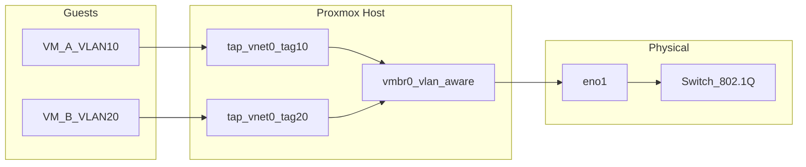

# Packet path diagram — VLANs on Proxmox (Fase 3)

Use this as a template: replace labels with your **hostnames**, **IPs**, and **switch ports**.

## Logical view

## Narrative (fill in)

1. **Egress from VM A:** Frame leaves guest with **no tag** (usually); the **tap** device adds **VLAN 10** on the bridge.
2. **On the wire:** One NIC carries **tagged** frames for VLAN 10 and 20 toward the switch.
3. **Switch:** Ports assigned to VLAN 10 or 20 (access) or trunk as designed.
4. **Return path:** Reverse; bridge strips/delivers to correct guest.

## Your drawing

If you prefer Excalidraw or paper, sketch: **Guest → tap → bridge → NIC → switch → router**.

## Exit criteria

- [ ] Diagram saved (this file or exported PNG) with your labels.
- [ ] You can explain **where** tagging happens in your setup.
