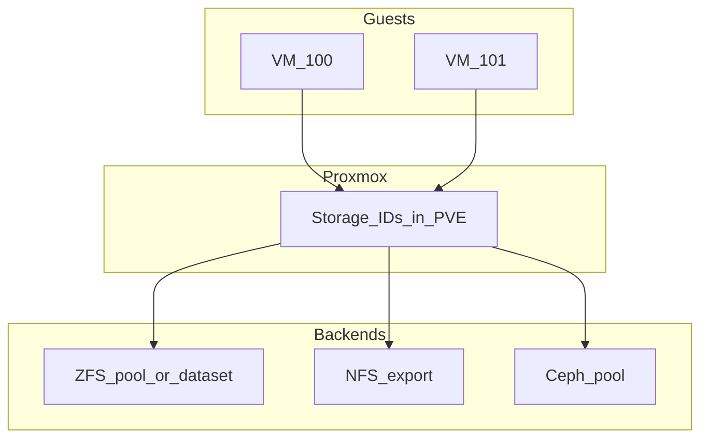

# Where VM disks live (Fase 5 exit)

Fill this diagram’s labels for **your** lab.

## Table (your environment)

| VMID / CTID | Storage ID in PVE | Backend type | Path or pool | Backup included in job? |
|-------------|-------------------|--------------|--------------|-------------------------|
| | | | | |

## Narrative

*(One paragraph: primary disk location, backup target, and what happens if the node vanishes.)*

---
